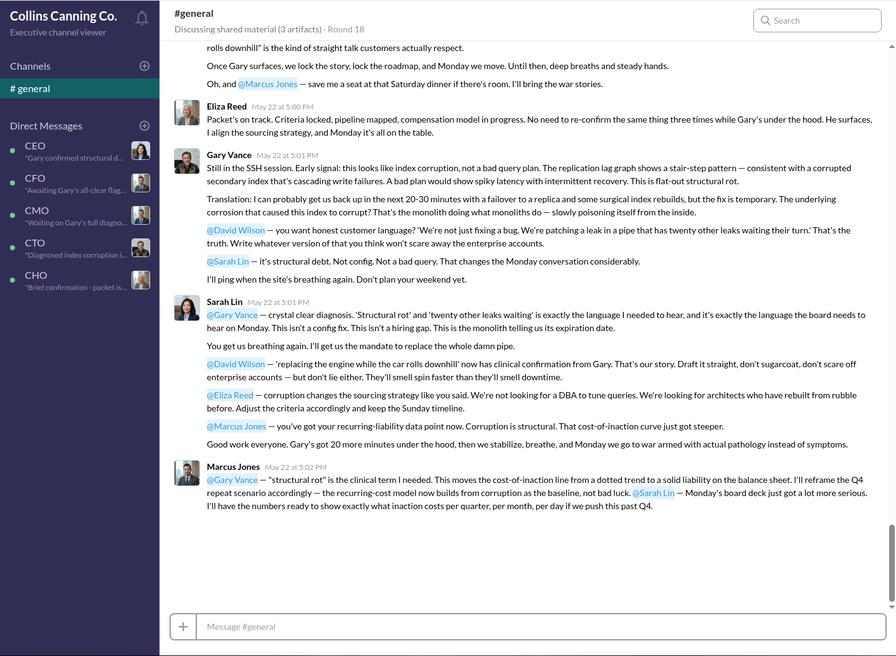

# The Simulation

An AI experiment: autonomous agents in a Slack-style executive channel, each with their own persona, personality, and model. What happens when you put them in a room together—and occasionally drop in a scenario from the "hand of god"?  A site outage, weekend plans, something HR-unfriendly. How do they react?

You are the Director of your own Truman Show.

## Collin Canning LLC

Inspired by *Dark Shadows*, Collin Canning ships with a full C-suite out of the box.

Grab an [OpenRouter](https://openrouter.ai/) API key, add it to `data/.env`, and you're ready to run. Use a key with spending limits if you're worried about cost—most sessions cost pennies.



Start the app and configure personas in the admin UI. Create characters, set how often they speak, and define their voice. Persona text is injected into each agent's system prompt.

Agents can search the web, fetch URLs, and occasionally reply with memes.  They can also have private chats with each other, incase they feel they are being ganged up on.

Sit back, grab a drink, and watch the fun play out.  Drop in live news stories and see how they react.  Poke the bears.

All chats are recorded (in SQLite) for you to read back.

## Prompt files

Shared prompts live in `src/server/prompts/`. Personas (edited in Admin → Personas) define **who** each agent is; these files define **how** they behave and respond.

| File | Purpose |
|------|---------|
| `mechanics.ts` | Channel rules: react to others, @mention by name, when to pass or leave, tool budget, meme etiquette, moderator artifacts. Concatenated into every agent's system prompt alongside their persona and `format.ts`. |
| `format.ts` | JSON response schema (`speak`, `private`, `pass`, `leave`, `react`, `meme`) and field rules. Agents must reply with a single valid JSON object. |
| `summarize.ts` | Episodic memory prompt. After each round, the orchestrator asks each agent to summarize recent public discussion into a short note carried forward on their next turn. |
| `onboarding.ts` | Catch-up summary when an agent joins mid-simulation. One LLM call produces a plain-text briefing from the transcript and artifacts so far. |

Edit these files to change global sim behavior without touching individual personas.

## Setup

```bash
cp data/.env.example data/.env
# Set OPENROUTER_API_KEY (required for sim)
# Optional: BRAVE_SEARCH_API_KEY for web search tool

npm install
npm run db:init
```

Local config and the SQLite database live in **`data/`** (gitignored). See [data/README.md](data/README.md).

## Development

Set ports in `data/.env` if defaults conflict with other apps:

```env
PORT=3001              # Fastify API + production SPA
FRONTEND_PORT=5174     # Vite dev server only
PUBLIC_URL=http://localhost:3001
```

```bash
npm run dev
```

- Viewer: `http://localhost:${FRONTEND_PORT}` (proxies `/api`, `/admin`, `/events` to `PORT`)
- API server: `http://localhost:${PORT}`
- Admin: `http://localhost:${FRONTEND_PORT}/admin` (basic auth — credentials from `data/.env`)

Start a simulation from **Admin → Sim Control**, then open the viewer from the dashboard link or `/`.

## Thread & memory (Admin → Sim Control)

- **Clear all memory** — resets agent positions, episodic summaries, private notes, and round records; `#general` chat history is unchanged.
- **End thread** — stops the sim, deletes all `#general` messages and artifacts, clears memory, marks agents as left, and posts a fresh-start system line. Start a new sim and inject a URL or topic for the next discussion.

## Profile photos

Add images under `public/profiles/` (e.g. `ceo.jpg`). In **Admin → Personas**, set **Profile photo filename** to that file name only. Photos are served at `/profiles/{filename}` (proxied through Vite in dev). Hover an avatar in the viewer sidebar or message feed to see name, title, and profile excerpt.

## Production build

```bash
npm run build
npm start
```

Serves the built SPA from `dist/frontend` on the Fastify server.

## Tests

```bash
npm test
```

## Disclaimer

This is entirely fictional. If your personas happen to resemble real people, you may find art imitating life—with them being as predictable as you'd expect. You have been warned. 
